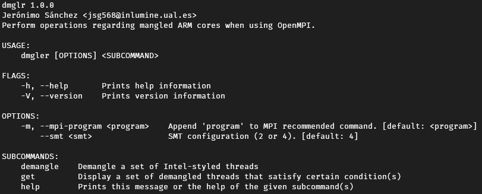

   Copyright 2020 The University of Edinburgh

   Licensed under the Apache License, Version 2.0 (the "License");
   you may not use this file except in compliance with the License.
   You may obtain a copy of the License at

       http://www.apache.org/licenses/LICENSE-2.0

   Unless required by applicable law or agreed to in writing, software
   distributed under the License is distributed on an "AS IS" BASIS,
   WITHOUT WARRANTIES OR CONDITIONS OF ANY KIND, either express or implied.
   See the License for the specific language governing permissions and
   limitations under the License.

# dmgler
This is the demangling tool to generate correctly mapped mpirun lines for OpenMPI.

## Installation
+ Download the binary for the target system form the releases section or [build](#Build) it yourself.

## Usage

Help can also be used on the subcommands.

## Build
+ Latest version of [Rust](https://www.rust-lang.org/tools/install) must be installed in the system.
+ Execute ``cargo build --release``.
+ Binary will be under ``/target/release/`` with the name **dmgler** and the correct executable extension for the system.